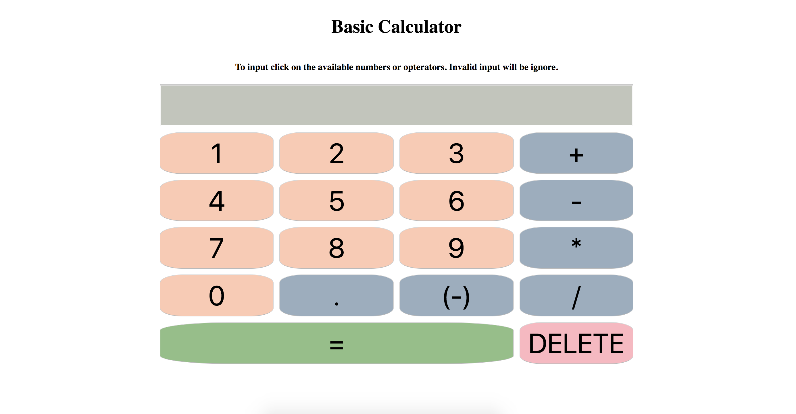

# Calculator
## This is a take home project given by interviewer, user React to build a simple calculator in 1 week.
- [Github link](https://github.com/fruit13ok/calculator).
- [Heroku link](https://yicalculator.herokuapp.com/).
- 

### outline
Basic calculator has 17 components<br>
1 input field for display only<br>
16 buttons: 0,1,2,3,4,5,6,7,8,9,+,-,*,/,=,DELETE
Each button is reusing the button component, so it can pass value back to parent.
Parent keep a state variable as string tracking all button press.
Calculate base on that string variable.

### 4-10-2019
1. Begin the project with<br>
`create-react-app calculator`
2. Remove default files
3. Create some basic files<br> `index.js`, `components/App.js`, `components/App.css`
4. Start writing<br> `README.md`
5. Create and push to github.
6. Start from front end, build static input and buttons.
7. Build input field only to display string variable trask all button presses, and result.
8. Build button component takes 2 props button text and lift up function to pass button text onClick.

### 4-11-2019
9. Think about how to store input into a math expression, keep it valid, evaluate the expression.
10. Change placeholder curExpression from string to array to store input in operator / operand format.<br>
[123,+,40,-,1]
11. Set some constraints to keep this project simple, only deal with integer input.
12. Google how to eveluate math expression stored in array.<br>
The way is to convert from array to string then use<br>
`eval()`
Need to ignore eslint warning,
`/* eslint no-eval: 0 */`

### 4-12-2019
13. To keep the store math expression valid, created the following condition.
```
if [] empty
    only allow cancat digit 1 to 9, NOT start with 0, nor operator
if not empty
    if last index is digit
        if input is digit
            reassign to that index with new concat string
        if input is +/-*
            push / concat to next index
        if input is =
            array to string, eval string
        if input is DELETE
            pop / slice out last index
    if last index is +/-*
        if input is digit
            push / concat to next index
        if input is +/-*=
            ignore
        if input is DELETE
            pop / slice out last index
```
14. Implement onButtonPressed() to take care input and math expression validation.
15. Test run the calculator, debug, fixed, repeat, it work, stop functional implementation.
16. Start to add some style.
17. Create a grid to wrap the 17 components.
18. Set some colors, which added one more prop 'color' pass to Button child component to set button color.
19. Added Title and user instruction, which changed the way of centering using flexbox.
20. Basic milestone completed. Think about what to do next.

### 4-13-2019 (Whole day study group: data structure and algorithm)
21. List of extra thing to add:
   1. Pick 5 colors<br>
   FFCAB1 8CC084 9AADBF C2C5BB C97C5D<br>
   I change prop 'color' to cssStyle, to pass all style in one prop
   2. Learn and apply unit test for React<br>
   Jest and Enzyme
   3. Decimal input<br>
   base on javascript evel() decimal should be operand, that means part of a number
   4. Negative input<br>
   base on javascript evel() negative sign is a operator, (-1)*number.<br>
   add a button (-) that push in negative into array, '(-1)*'
   5. More css
   6. Deploy to Heroku
   7. Ask interviewer for early feed back.

### 4-14-2019 (Sunday: day off)

### 4-15-2019
22. Make change to condition to add negative / decimal inputs
```
if [] empty
    only allow cancat digit 1 to 9, NOT start with 0, nor operator, negative sign (-1)*, decimal point
if not empty
    if last index is .
        if input is digit
            reassign to that index with new concat string
        if input is DELETE
            pop / slice out last index
    if last index is (-)
        if input is .
            push / concat to next index
        if input is digit
            push / concat to next index
        if input is DELETE
            pop / slice out last index
    if last index is digit
        if input is .
            if current index number not decimal
                reassign to that index with new concat string
        if input is digit
            reassign to that index with new concat string
        if input is +/-*
            push / concat to next index
        if input is =
            array to string, eval string
        if input is DELETE
            pop / slice out last index
    if last index is +/-*
        if input is .
            push / concat to next index
        if input is (-)
            push / concat to next index
        if input is digit
            push / concat to next index
        if input is DELETE
            pop / slice out last index
```
23. Implement negative input, add button '(-)' and '.', add conditions.
24. Refactored the long onButtonPressed() function with helper functions, and variable.
25. Added css for font size, input field, and buttons.
26. Deploy to Heroku
   1. Push the complete version to Github
   2. Check Node and NPM version
   `$ node --version` and `$ npm --version`
   3. Tell Heroku project version of Node and NPM, edit `package.json` with<br>
   ```
   "engines": {
      "node": "10.7.0",
      "npm": "6.2.0"
   },
   ```
   4. Log in to Heroku from terminal
   `$ heroku login`
   5. Add git remote branch to project point to Heroku's servers
   `$ heroku create`
   6. Push project to Heroku remote branch, might need to add / commit again
   `$ git push heroku master`
      1. Might need to update yarn lockfile
      ```
      $ yarn install
      $ git add yarn.lock
      $ git commit -m "Updated Yarn lockfile"
      $ git push heroku master
      ```
   7. Rename project
   `heroku apps:rename yicalculator`